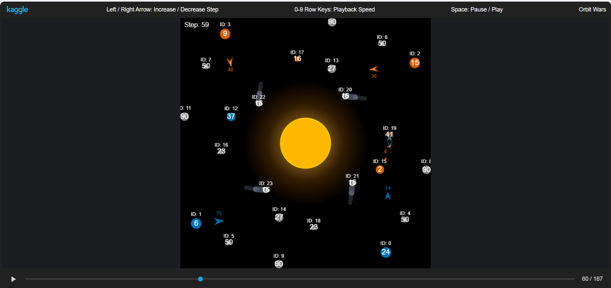

# Orbit Wars

Dự án này phát triển một AI agent cho cuộc thi Orbit Wars trên Kaggle. Trong đó

- Nhánh working để chạy, test, debug Agent
- Nhánh An lưu trữ các version của Agent

## Tổng quan về Orbit Wars

Orbit Wars là một trò chơi chiến thuật thời gian thực (RTS) 2D trong không gian liên tục:

- Bản đồ: Kích thước 100x100 với mặt trời ở trung tâm.
- Hành tinh: Sản sinh tàu vũ trụ theo thời gian. Các hành tinh gần tâm sẽ quay quanh mặt trời.
- Hạm đội: Di chuyển theo đường thẳng, tốc độ di chuyển tỷ lệ thuận với số lượng tàu.
- Mục tiêu: Kiểm soát được nhiều tàu và hành tinh nhất sau 500 bước.

Chi tiết về cuộc thi vui lòng xem tại: https://www.kaggle.com/competitions/orbit-wars/overview

## Cấu trúc thư mục

- `OrbitalOverlord.py` và `RuleBasedBot.py`: Agent chính.
  Ngoài ra các agent qua các version được push lên branch `An`
- `train_overlord.py`: Script dùng để huấn luyện mô hình.
- `custom_env/`: Wrapper Gymnasium mô phỏng lại môi trường thi đấu của Kaggle.
- `orbit_lite/`: Thư viện hỗ trợ tính toán hình học, quỹ đạo và góc nhìn.
- `enemy/`: Chứa các bot mẫu dùng để làm đối thủ khi huấn luyện và kiểm thử.
- `record_match.py`: Script ghi lại trận đấu và xuất ra file replay định dạng JSON.

## Cài đặt

Dự án yêu cầu Python 3.8 trở lên. Cài đặt các thư viện cần thiết bằng lệnh sau:

```bash
pip install -r requirements.txt
```

## Hướng dẫn sử dụng

### Chạy thử nghiệm

### Xuất Replay

Để xuất file `.json` dùng cho việc xem lại trận đấu trực quan trên giao diện của Kaggle:

```bash
python record_match.py
```



- Thay vì mặc định giống các code getting started đã được public của kaggle, code hiện tại sẽ render id của các hành tinh, log thực thi được lưu qua bot_debug.log để có thể debug, hiểu cơ chế vận hành của agent hiện tại.

- Về đối thủ, có thể chọn lựa
  - do_nothing_agent: 1 agent không làm gì cả
  - enemy1, enemy2, enemy3, enemy4: các đối thủ
    Để thay đổi đối thủ cũng như chế độ đấu, thay đổi thêm đối thủ vào code sau:
    `env.run([enemy_agent4, OrbitalOverlord.agent])`

### Huấn luyện mô hình

Để bắt đầu quá trình huấn luyện một agent mới (mặc định thì heuristic):

```bash
python train_overlord.py
```

### Đóng gói nộp bài (Submission)

Các tệp cần thiết để nộp bài đã được tự động chuẩn bị trong thư mục `submission/`. Di chuyển vào thư mục này và nén chúng thành tệp `.tar.gz` để gửi lên hệ thống Kaggle:

```bash
cd submission
tar -czf submission.tar.gz main.py model_overlord.pth orbit_lite/
```
